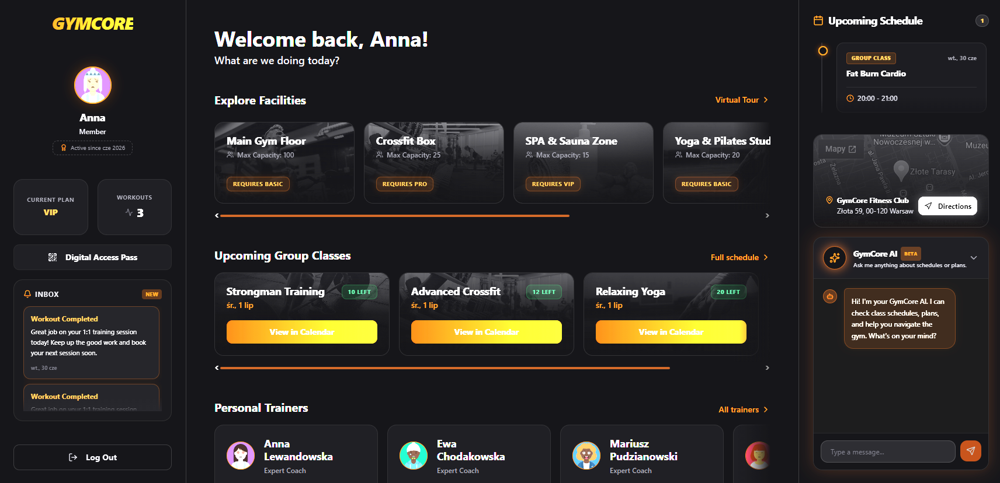
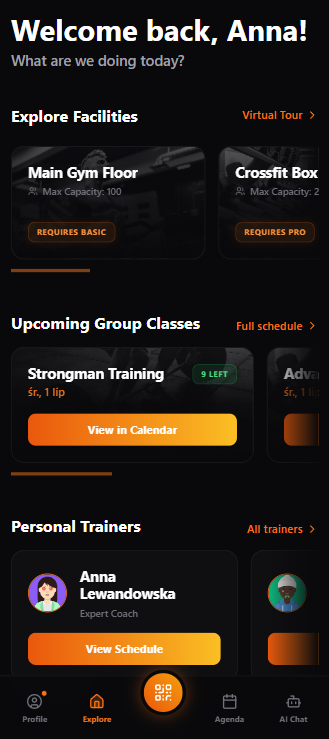
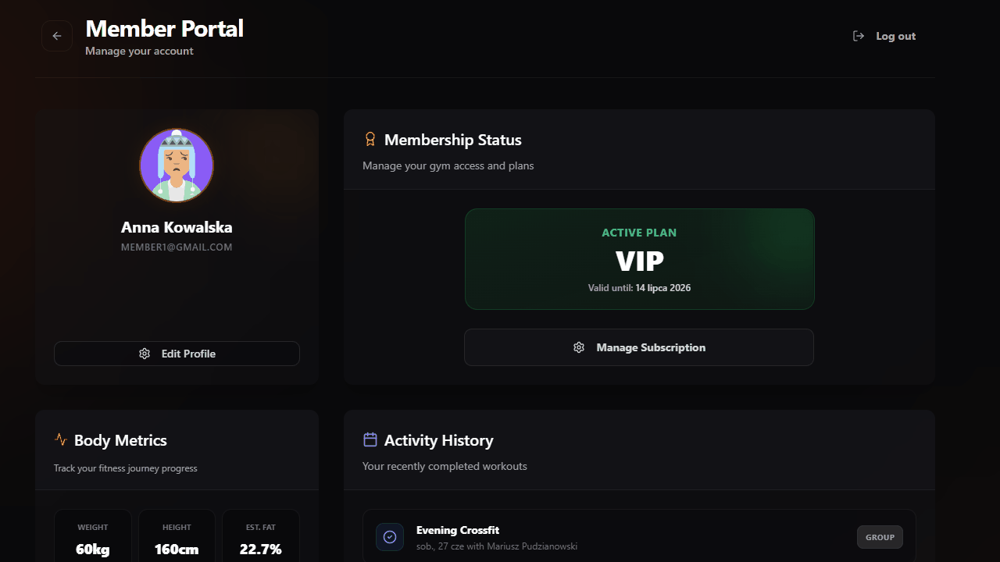
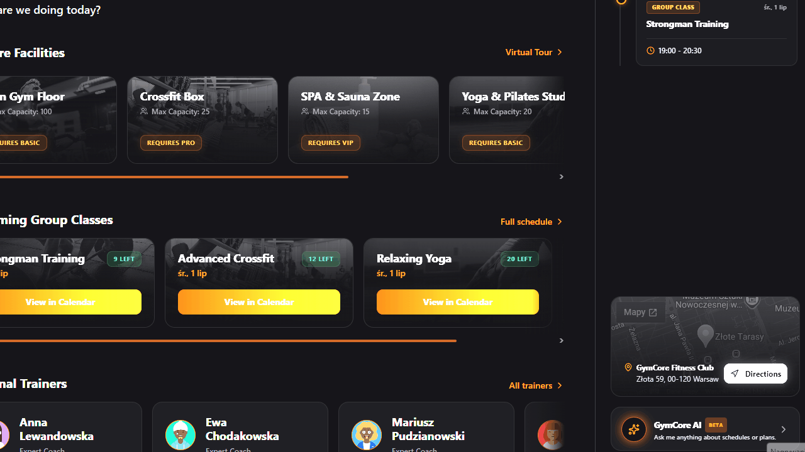
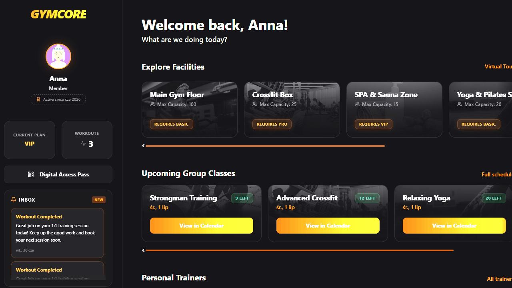
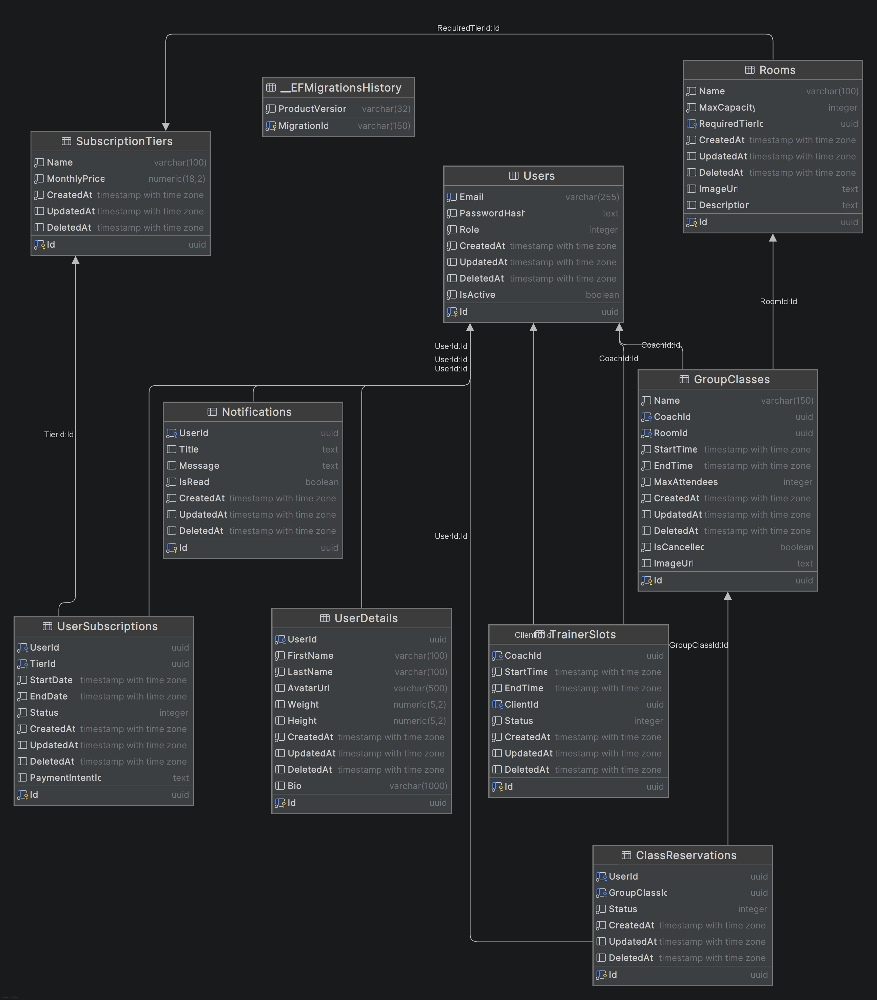
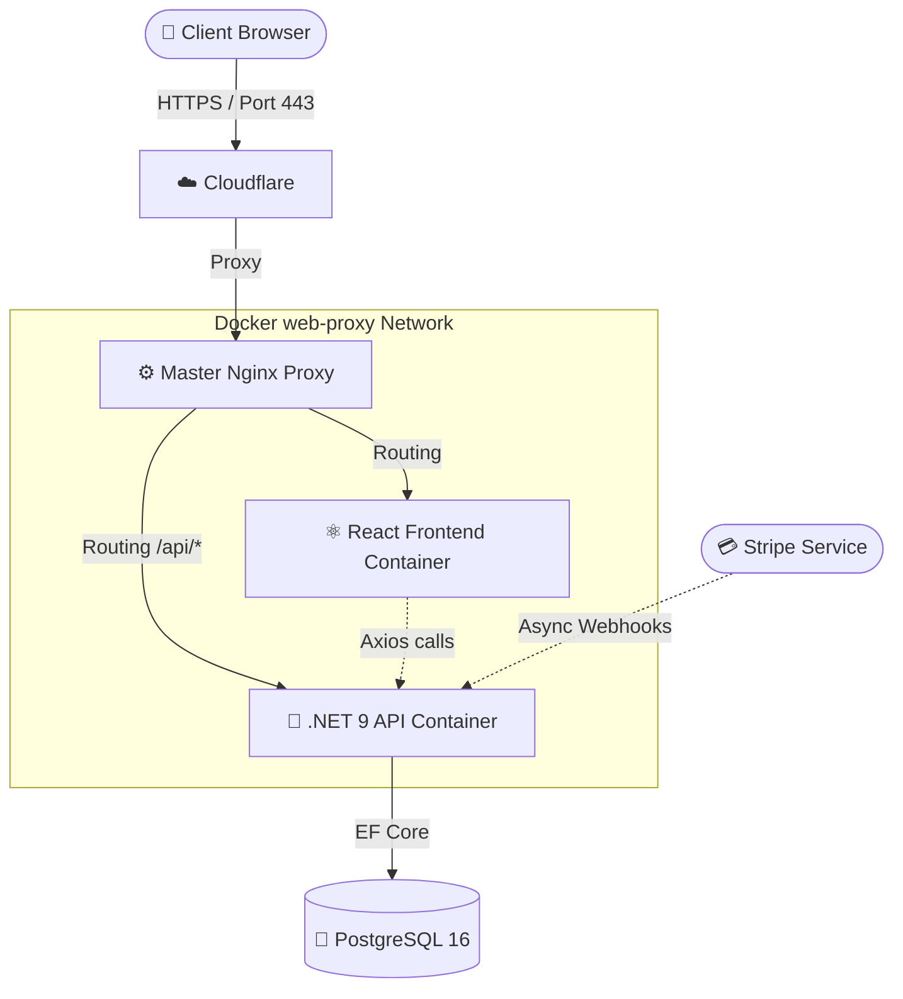

# GymCore - E2E Fitness SaaS Platform

[](https://dotnet.microsoft.com/)
[](https://docs.microsoft.com/en-us/dotnet/csharp/)
[](https://reactjs.org/)
[](https://www.typescriptlang.org/)
[](https://www.postgresql.org/)
[](https://www.docker.com/)
[](https://stripe.com/)
[](https://learn.microsoft.com/en-us/azure/architecture/patterns/cqrs)

A comprehensive, highly-concurrent SaaS platform built for boutique fitness clubs. Engineered from the ground up using **.NET 9**, **React + TypeScript**, and **PostgreSQL**. Designed with Clean Architecture principles, enforcing a strict separation of concerns and robust transactional safety.

---

<div align="center">
  
</div>

---

## 📖 Table of Contents
1. [Project Overview & Live Demo](#1-project-overview--live-demo)
2. [Key Business Features](#2-key-business-features)
3. [Architectural Marvels (Tech Deep Dive)](#3-architectural-marvels-tech-deep-dive)
4. [Technology Stack](#4-technology-stack)
5. [Project Structure](#5-project-structure)
6. [Getting Started (Local Deployment)](#6-getting-started-local-deployment)
7. [Test Scenarios](#7-test-scenarios)
8. [Deployment & Infrastructure](#8-deployment--infrastructure)
9. [Error Handling and Diagnostics](#9-error-handling-and-diagnostics)

---

## 1. Project Overview & Live Demo

GymCore serves as a full-fledged ecosystem bridging the gap between club members, personal trainers, and facility administrators. It seamlessly handles subscription life-cycles, strict facility access, dynamic pricing, and concurrent booking engines.

**Production Environment:** Fully containerized and deployed on a VPS via Nginx Reverse Proxy.  

🚀 **Live Demo:** [gymcore.com.pl](https://gymcore.com.pl)  

*To quickly log in and test it, here's an example login:*

- member1@gmail.com | Member123!  
- mariusz@gmail.com | Coach123!

*For obvious reasons, I won't include the admin login details :)*


---

## 2. Key Business Features

### 📱 Mobile-First Experience

| | |
| :--- | :--- |
|  | The project was built with a *Mobile-First* philosophy in mind. The interface seamlessly adapts to smartphone screens, providing a native experience without the need to install a dedicated app. <br><br> <ul><li><b>Adaptive Navigation:</b> The desktop sidebar automatically transforms into an intuitive bottom navigation bar.</li><li><b>Touch-Friendly UX:</b> Components and forms optimized for thumb navigation.</li><li><b>Compact Views:</b> Intelligently displays only key data on small screens.</li></ul> |

<br clear="all"/>

### 💳 Stripe-Powered Subscriptions


Memberships are managed by an advanced state machine. Integration with the Stripe API enables secure, asynchronous payments.

* **Dynamic States:** Real-time status monitoring (Active, Expiring, Grace Period).
* **Asynchronous Billing:** Full transaction processing via secure webhooks.
* **Discount Engine:** Backend discount calculation before payment is finalized.

<br clear="all"/>

### 📅 High-Concurrency Booking Engine


The reservation system handles high traffic volumes and concurrent requests, ensuring smooth operation during peak hours.

* **Concurrency Control:** Database-level locks eliminate overbooking.
* **Real-time Capacity:** Instant updates of available spots in group sessions.
* **Flexible Logic:** Supports group classes and individual one-on-one sessions with trainers.

<br clear="all"/>

### 🤖 AI Assistant & Google Maps


Advanced tools optimize navigation and management processes within the club.

* **Google Maps API:** Quick club location and routing for new members.
* **DeepSeek AI Support:** Intelligent analytics on occupancy and revenue in real time.
* **Management Guidance:** Proactive recommendations for optimizing the activity schedule.

<br clear="all"/>

### 🔐 Automated Access Control & Dynamic QR Passes


GymCore eliminates the need for physical membership cards.

* **Encrypted QR Codes:** Unique, time-based codes generated from JWT tokens.
* **Instant Verification:** Verify entry credentials at the reception desk in a fraction of a second.
* **Anti-Fraud:** Single-use tokens eliminate the risk of unauthorized access sharing.

<br clear="all"/>

---

## 3. Architectural Marvels (Tech Deep Dive)

This project was built to demonstrate enterprise-grade patterns and solve complex backend challenges:

- **Clean Architecture & CQRS:** The `.NET` backend utilizes the `MediatR` library to enforce the Command Query Responsibility Segregation pattern. This separates read operations from state-mutating commands, allowing for targeted optimization and strict input validation via `FluentValidation` pipelines.  
  👉 [View CQRS Handler implementation](https://github.com/zephir-x/gymcore/blob/main/backend/GymCore.Application/Features/Admin/Queries/GetAdminClasses/GetAdminClassesQuery.cs)
- **Optimistic Concurrency Control:** Implemented EF Core's `RowVersion` handling. If two users attempt to book the last spot in a class simultaneously, the database rejects the conflicting transaction, ensuring capacity integrity.
- **Background Hosted Services (Workers):** - `ScheduleGeneratorWorker`: Autonomously generates upcoming class schedules and trainer slots on a rolling window without freezing the main API thread. Optimized for specific weekday triggers.  
  👉 [View Background Worker logic](https://github.com/zephir-x/gymcore/blob/main/backend/GymCore.Api/Workers/ScheduleGeneratorWorker.cs)
- `GuardWorker`: Monitors and updates expired subscription statuses autonomously.
- **Stripe Webhooks:** Asynchronous payment fulfillment. The API listens to cryptographically signed Stripe webhooks to definitively activate user subscriptions only when the bank clears the transaction.  
  👉 [View Webhook endpoint implementation](https://github.com/zephir-x/gymcore/blob/main/backend/GymCore.Api/Controllers/WebhooksController.cs)
- **Custom React Hooks:** Implementation of highly reusable hooks like `useDocumentTitle` to dynamically modify the SPA's metadata state during client-side routing.  
  👉 [View Custom Hook code](https://github.com/zephir-x/gymcore/blob/main/frontend/src/hooks/useDocumentTitle.ts)

### 📊 Database Schema (ERD)
The following diagram shows a relational database structure (3NF) that ensures transactional consistency for subscriptions, users, and the reservation system:



*Key Relationships:*
- **1:N:** User <-> Reservations (cascading deletes used).
- **M:N:** Roles <-> Permissions (secured by associative tables).
- **Concurrency:** Each reservation table has a `RowVersion` column to support optimistic locking (Optimistic Concurrency).

---

## 4. Technology Stack

| Layer | Technologies & Tools |
| :--- | :--- |
| **Backend** | .NET 9, C# 13, ASP.NET Core Web API, MediatR, FluentValidation |
| **Frontend** | React 18, TypeScript, Vite, TailwindCSS, React Query, Axios |
| **Database** | PostgreSQL 16, Entity Framework Core (Code-First) |
| **Infrastructure** | Docker, Docker Compose, Nginx (Reverse Proxy & Static Server) |
| **Integrations** | Stripe API (Payments & Webhooks), DeepSeek API (AI Analytics) |
| **Security** | Custom BCrypt Hashing, JWT Bearer Authentication |

---

## 5. Project Structure

The repository is divided into two highly decoupled environments.

<details>
<summary><strong>Click to expand the Architecture Tree</strong></summary>

```text
gymcore/
├── backend/                             # .NET 9 Backend
│   ├── GymCore.Api/                     # Presentation Layer (Controllers, Middlewares, Workers)
│   ├── GymCore.Application/             # Business Logic (CQRS Handlers, Validation, Interfaces)
│   ├── GymCore.Domain/                  # Core Entities, Enums, Exceptions
│   ├── GymCore.Infrastructure/          # DB Context, EF Core Migrations, Identity, External Services
│   └── Dockerfile                       # Multi-stage build for the .NET API
├── frontend/                            # Vite + React Client
│   ├── src/
│   │   ├── components/                  # Reusable UI components
│   │   ├── context/                     # Global state management
│   │   ├── hooks/                       # Custom React Hooks (e.g., useDocumentTitle)
│   │   ├── lib/                         # Utility functions
│   │   ├── pages/                       # Route views
│   │   ├── App.tsx                      # Root component
│   │   ├── main.tsx                     # Entry point
│   │   └── index.css                    # Global styles
│   ├── Dockerfile                       # Multi-stage build (Node builder -> Nginx server)
│   └── nginx.conf                       # Client-side routing configuration for SPA
└── docker-compose.yml                   # E2E orchestration (DB, API, Frontend Proxy)
```

</details>

## 6. Getting Started (Local Deployment)

Run the entire E2E ecosystem locally using Docker Desktop.

### Prerequisites
- Docker & Docker Compose
- Node.js (Optional, for running frontend outside of Docker)

### Installation Steps

1. **Clone the repository:**
   ```bash
   git clone https://github.com/zephir-x/gymcore.git
   cd gymcore
   ```
2. **Configure Environment Variables:**  
   Create a `.env` file in the root directory. Use the provided `.env.example` template.
   ```bash
   cp .env.example .env
   ```
3. **Build and Spin Up Containers:**
   ```bash
   docker compose up -d --build
   ```
4. **Access the application** via `http://localhost:5173`

## 7. Test Scenarios

To quickly evaluate the system, use the following pre-seeded credentials:

| Role | Email               | Password     | Access Level |
| :--- |:--------------------|:-------------| :--- |
| **Administrator** | `admin@gmail.com`   | `Admin123!`  | Full CRUD, Analytics, Broadcasts |
| **Member** | `member1@gmail.com` | `Member123!` | Store, Bookings, Subscriptions |
| **Coach** | `mariusz@gmail.com` | `Coach123!`  | Class Attendees, Calendar |

**Workflow to test:**

1. **Log in as a Member:**
   Navigate to the **Subscriptions** tab and purchase a tier using the Stripe test card (`4242 4242 4242 4242`).

2. **Webhook Fulfillment:**
   Return to the app. Observe that your account status changes to *Active* via the Stripe Webhook fulfillment mechanism.

3. **Booking Engine:**
   Navigate to **Schedule** and book a class. Verify that the current attendee count increments correctly.

4. **Administrative Oversight:**
   Log out, and log in as the **Administrator**. Cancel the class you just booked. Navigate back to the Member view to confirm the cancellation is reflected dynamically.

---

## 8. Deployment & Infrastructure

The application is deployed as a multi-container solution managed by a Master Nginx Reverse Proxy, allowing for side-by-side hosting of multiple projects (like GymCore and GameNest) on a single VPS.

### Production Architecture Diagram



- **Nginx Proxy:** Handles SSL/TLS termination and routes traffic to the appropriate containers based on server names.
- **Internal Networking:** All projects reside within a shared `web-proxy` bridge network.
- **Persistence:** Docker volumes ensure database data is preserved across container restarts.

---

## 9. Error Handling and Diagnostics

- **Global Exception Handling:** The API utilizes a standardized `ProblemDetails` response format for all unhandled exceptions, ensuring clear API communication.
- **Logging:** Application logs are captured via Docker and can be inspected using `docker compose logs -f <service_name>`.

*Architected and developed by Kacper Gumulak - [zephir-x](https://github.com/zephir-x)*.